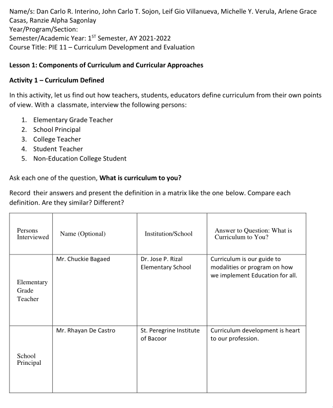
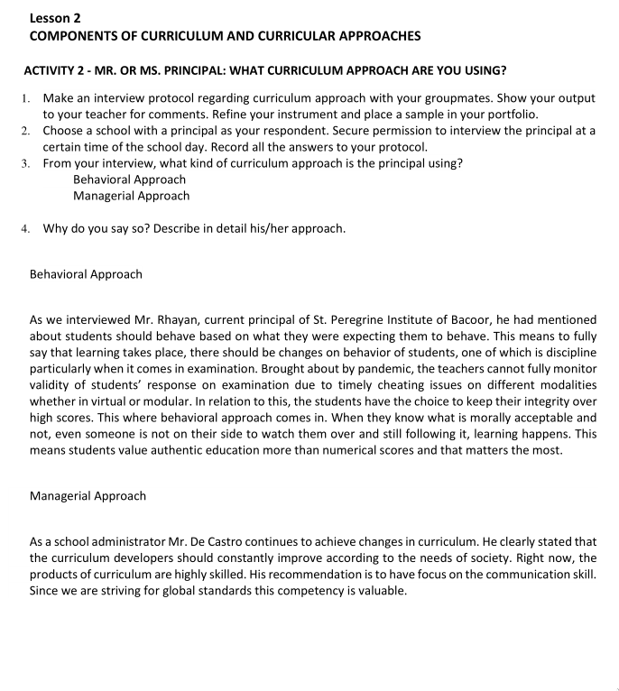
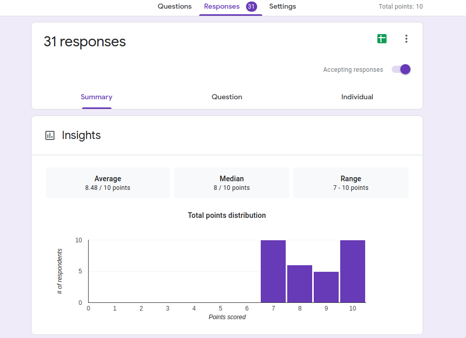
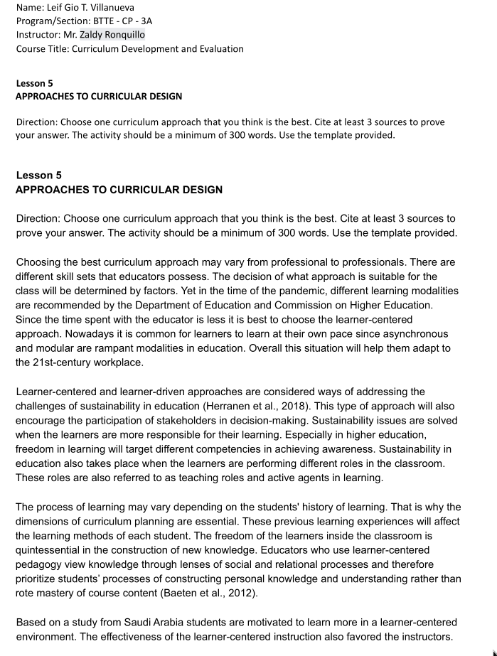
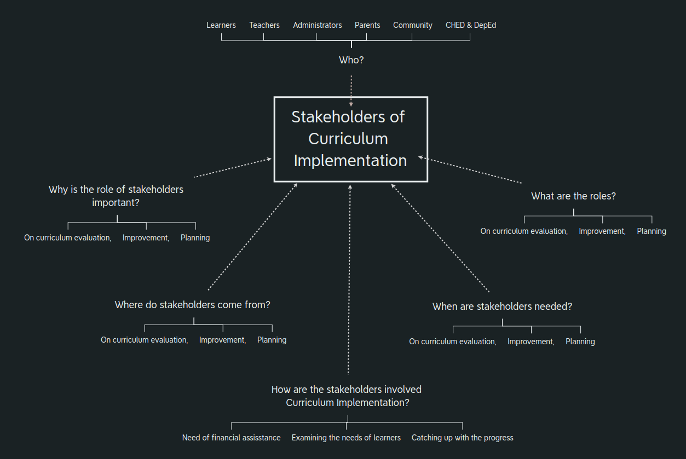
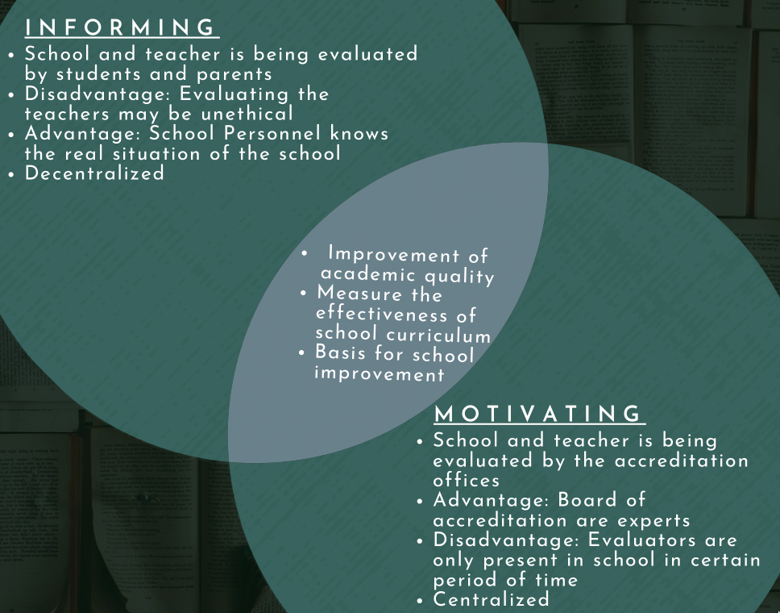
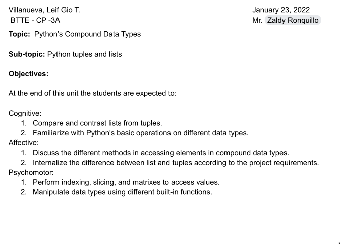
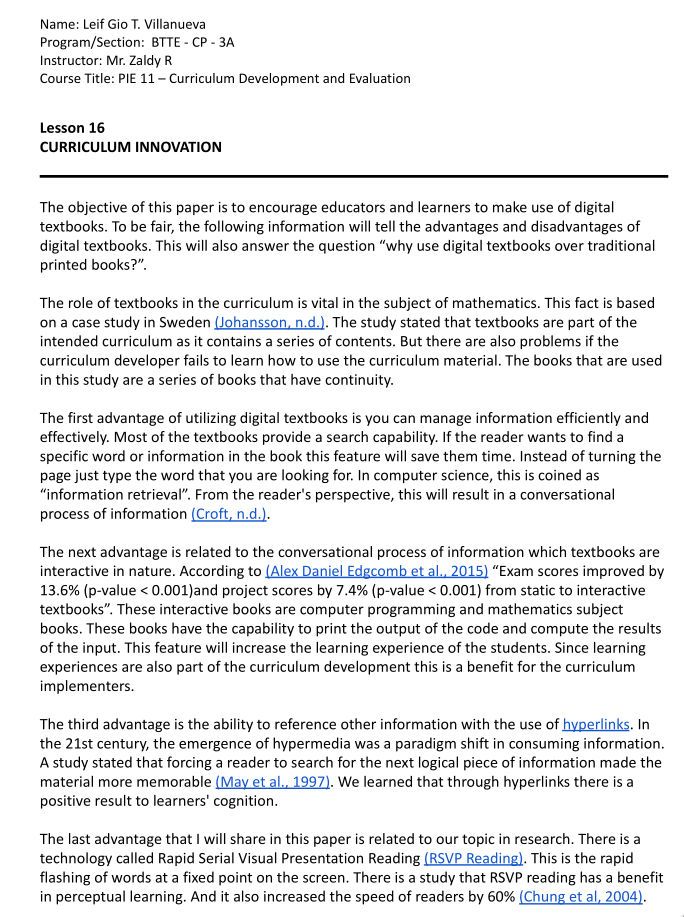

### Lesson 1 - Components of Curriculum and Curricular Approaches

[view full document](Interino_Sojon_Villanueva_Verula_Casas_Sagonlay_Act.pdf)

---

### Lesson 2 - Lesson Plan Analysis

[view full document](Interino_Sojon_Villanueva_Verula_Casas_Sagonlay_Act-1.pdf)

---

### Lesson 2 - Dimensions and Principles of Curriculum Design

[google forms link](https://forms.gle/oG1NhFZM7CrsWELz7)

---

### Lesson 5 - Approaches to Curricular Design

[view full document](Villanueva_Curriculum_Approach.pdf)

---

### Lesson 7 - Stakeholders' Roles in Curriculum Implementation

---

### Lesson 9 - Pilot Testing and Monitoring Curriculum- Part 1

<iframe width="100%" height="300" scrolling="no" frameborder="no" allow="autoplay" src="https://w.soundcloud.com/player/?url=https%3A//api.soundcloud.com/tracks/1216046818&color=%237c56c1&auto_play=true&hide_related=false&show_comments=true&show_user=true&show_reposts=false&show_teaser=true&visual=true"></iframe>
<a href="https://soundcloud.com/leif-gio-villanueva" title="ramon" target="_blank" style="color: #cccccc; text-decoration: none;">ramon</a> · <a href="https://soundcloud.com/leif-gio-villanueva/podcast-1" title="Podcast" target="_blank" style="color: #cccccc; text-decoration: none;">Podcast</a>

[download the podcast](podcast.wav)

---

### Lesson 9 - Pilot Testing and Monitoring of the Curriculum- Part 2

---

### Lesson 11 - School Based Evaluation and Accreditation

[download here](Villanueva_Group9.pdf)

----

### Lesson 16 - Curriculum Innovation

[download here](Villanueva_Lesson11.pdf)
