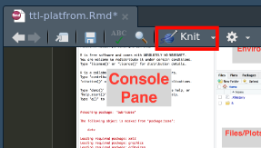

### Introduction

Name: Xaringan

Developer: Yihui Xie

Yihui Xie is a software engineer at RStudio. He earned his PhD from the Department of Statistics, Iowa State University. He is interested in interactive statistical graphics and statistical computing. As an active R user, he has authored several R packages, such as knitr, bookdown, blogdown, xaringan, animation, DT, tinytex, tufte, formatR, fun, mime, highr, servr, and Rd2roxygen, among which the animation package won the 2009 John M. Chambers Statistical Software Award (ASA). He also co-authored a few other R packages, including shiny, rmarkdown, and leaflet. He has published a number of books, including “Dynamic Documents with R and knitr”, “bookdown: Authoring Books and Technical Documents with R Markdown”, “blogdown: Creating Websites with R Markdown”, and “R Markdown: The Definitive Guide”.

In 2006, he founded the Capital of Statistics (https://cosx.org), which has grown into a large online community on statistics in China. He initiated the Chinese R conference in 2008, and has been involved in organizing R conferences in China since then. During his PhD training at Iowa State University, he won the Vince Sposito Statistical Computing Award (2011) and the Snedecor Award (2012) in the Department of Statistics.

Origin:

The name “xaringan” came from Sharingan (http://naruto.wikia.com/wiki/Sharingan) in the Japanese manga and anime “Naruto.” The word was deliberately chosen to be difficult to pronounce for most people (unless you have watched the anime), because its author loved the style very much, and was concerned that it would become too popular. The concern was somewhat naive, because the style is actually very customizable, and users started to contribute more themes to the package later.

It offers all the capabilities of an R Markdown document in a power-point format. You can present analysed data, present said results, create charts, and show maps in a xaringan presentation.

The xaringan package is based on the JavaScript library remark.js (https://remarkjs.com); remark.js only supports Markdown, and xaringan added the support for R Markdown as well as other utilities to make it easier to build and preview slides.


### Interface

#### Pre-requisites

1. Familiar in R Markdown syntax. (https://rmarkdown.rstudio.com/)

2. Install Rstudio IDE on your desktop (https://www.rstudio.com/products/rstudio/download/)

### Parts


#### Button



The only useful button in creating a Xaringan presentation is the knit button. The rest of the document is based on how you type your document.

#### How it works

1. If you use RStudio, it is easy to get started from the menu File -> New File -> R Markdown -> From Template -> Ninja Presentation


2. Edit the metadata. title, author, ate, institute.


3. How to make a slide

Make slides with three trailing dashes: ---

```r
---
# How to make a slide

Type the content of your presentation here
```


4. How to make incremental reveals

Type two dashes in a row --

```r 
# Incremental reveals sample

--

Press the arrow ko to show the next reveal

-- 

Another reveal
```

Incremental slides are the same as the animation in powerpoint presentation

5. How to insert a picture

```r

```


Insert the title of the image inside the brackets. And the path of the file is typed inside the parentheses

6. Click the knit button in RStudio

7. Presenting your slides

Shortcut keys:

arrow keys: to navigate between pages

h : Help

c : Copy to new window

p : Presenter mode

m : Mirror

f : Full screen

b : Black out

t : Start/stop timer

p: to show the presenter notes

The sample file is can be downloaded in [Google Drive](https://drive.google.com/file/d/1IKmOPS-kRr_-YDQrXGS0g2X4wheZpeYl/view?usp=sharing). This is only the Rmd file, you will need to click the knit button in RStudio to create a html file.

This is an example of a [Xaringan presentation](https://leifgio.github.io/presentation).

### Generalization

Xaringan is just one of the possible outputs that you can do with R Markdown. Though creating this requires your time to learn. I just demonstrated Xaringan presentations because creating a elegant presentation is what I want to share to my classmates.

#### Opinions

Xaringan presentations looks so simple to the viewers but very elegant and clean. I encourage you to use this platform for presenting a topic that needs emphasis on the content rather than the visual aspect.

This platform is for the people that are willing to learn how to code. From my own experience this platform is a lot faster than creating a presentation with a software that has graphical user interface. But the drawback is at first you will find it very hard because you can not see the actual presentation when you are writing.

In conclusion, if you are interested and impressed on this presentation then you should learn how to create xaringan presentations. This platform is a open source project, that means it is free for all. Your time and dedication to learn is also needed if you are willing to learn

#### Suggestions
 
If you want to level up your presentation read on this [xaringanExtra](https://pkg.garrickadenbuie.com/xaringanExtra/#/?id=xaringanextra). This page has the advanced concepts of creating Xaringan presentations. 

R Markdown is another platform to learn after the Xaringan presentations. This platform has a lot of capability more than the Xaringan presentations. I also created this pdf file using R Markdown. The beauty of this platform is you can create many file outputs just by writing a single file. You will just change the output in the metadata. 

As a teacher we are creating a lot of course units, modules, and powerpoint presentations. To save time from all the effort why not create just one file. The R Markdown is responsible for changing it to different file types.

Here are some of my works using R Markdown:

https://leifgio.github.io/presentation

https://flamboyant-jepsen-e932de.netlify.app

https://leifgio.github.io/TTL2

https://leifgio.github.io/PIE-7

You can create a website, pdf, e-books and try to explore for more capabilites that you can do with R Markdown. Even this presentation is created with R Markdown


### References

About - Yihui Xie (2020). Yihui.org. https://yihui.org/en/about/

Grolemund, G. (2021, April 9). Chapter 7 xaringan Presentations | R Markdown: The Definitive Guide. Bookdown.org. https://bookdown.org/yihui/rmarkdown/xaringan.html

Magwene, P. M. (2021, April 19). Chapter 2 Getting Started with R | Biology 723: Statistical Computing for Biologists. Github.io. https://bio723-class.github.io/Bio723-book/getting-started-with-r.html

Sands, D. (2020, May 15). How to make Xaringan presentations. Github.io. https://psysandsy.github.io/xaringan-teach.html#27


